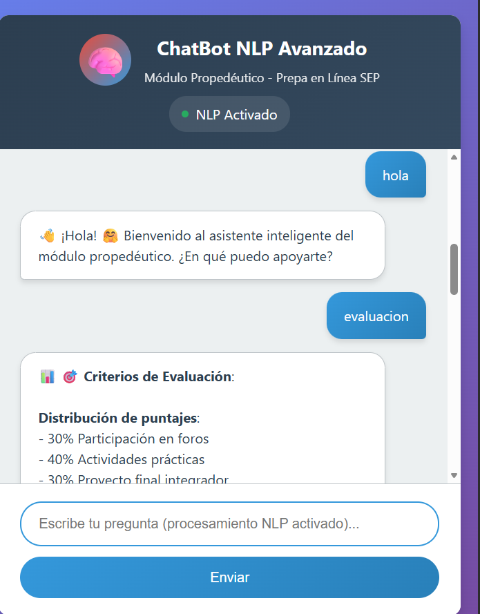

# 🚀 Asistente Virtual Inteligente para Educación | NLP en Español

<div align="center">


**ChatBot académico especializado con Procesamiento de Lenguaje Natural para el módulo propedéutico**

[Características](#-características) • [Demo](#-demo) • [Instalación](#-instalación) • [Uso](#-uso) • [Estructura](#-estructura-del-proyecto)

</div>

<div align="center">


*Interfaz moderna del ChatBot mostrando el procesamiento NLP en tiempo real con respuestas contextuales*

</div>

## 📖 Descripción

ChatBot especializado desarrollado con **Procesamiento de Lenguaje Natural (NLP) avanzado** para asistir a estudiantes del módulo propedéutico de Prepa en Línea SEP. Combina técnicas modernas de NLP con una arquitectura escalable para proporcionar respuestas inteligentes, contextuales y en tiempo real.

### 🎯 Problema Resuelto

- ✅ Asistencia 24/7 para estudiantes con consultas académicas
- ✅ Reducción de carga administrativa mediante automatización inteligente
- ✅ Respuestas consistentes y basadas en conocimiento especializado
- ✅ Adaptación al lenguaje natural del estudiante

---

## 🛠️ Stack Tecnológico

### 🧠 Núcleo de Inteligencia

| Componente | Tecnología | Propósito |
|------------|------------|-----------|
| **Procesamiento NLP** | spaCy, NLTK | Análisis lingüístico en español |
| **Machine Learning** | scikit-learn | Clasificación de intenciones |
| **Word Embeddings** | spaCy vectors | Similitud semántica |
| **Backend** | Flask, Python | API RESTful |
| **Frontend** | HTML5, CSS3, JS | Interfaz moderna |

### 📊 Arquitectura del Sistema

```
┌─────────────────┐    ┌──────────────────┐    ┌─────────────────┐
│   Interfaz Web  │◄──►│   API Flask      │◄──►│  Motor NLP      │
│   (Frontend)    │    │   (Backend)      │    │  (spaCy+NLTK)   │
└─────────────────┘    └──────────────────┘    └─────────────────┘
                              │                         │
                              ▼                         ▼
                    ┌──────────────────┐    ┌─────────────────┐
                    │  Base Conocimiento│    │  Clasificador   │
                    │  (Intenciones)   │    │     ML          │
                    └──────────────────┘    └─────────────────┘
```

---

## 🎯 Características

### 🤖 Capacidades NLP Avanzadas

- ✅ Procesamiento de lenguaje natural en español con spaCy
- ✅ Clasificación de intenciones con múltiples estrategias (ML + Reglas + Semántica)
- ✅ Reconocimiento de entidades nombradas (personas, organizaciones, lugares)
- ✅ Análisis de sentimiento en tiempo real
- ✅ Similitud semántica con word embeddings
- ✅ Normalización de texto y expansión de términos

### 💬 Sistema de Conversación

- ✅ 13 intenciones especializadas en educación
- ✅ 130+ patrones de reconocimiento con variaciones
- ✅ Respuestas contextuales y personalizadas
- ✅ Detección de confianza en cada respuesta
- ✅ Sugerencias inteligentes basadas en contexto
- ✅ Manejo de ambigüedades y consultas incompletas

### 🎨 Experiencia de Usuario

- ✅ Interfaz web responsive y moderna
- ✅ Tiempo real con indicadores visuales
- ✅ Preguntas rápidas para acceso inmediato
- ✅ Historial de conversación persistente
- ✅ Diseño institucional SEP

---

## 📦 Instalación

### Prerrequisitos

- Python 3.8 o superior
- pip (gestor de paquetes Python)
- Git

### 🚀 Configuración Rápida

```bash
# 1. Clonar el repositorio
git clone https://github.com/tu-usuario/chatbot-nlp-educativo.git
cd chatbot-nlp-educativo

# 2. Crear entorno virtual (recomendado)
python -m venv venv
source venv/bin/activate  # Linux/Mac
# venv\Scripts\activate   # Windows

# 3. Instalar dependencias
pip install -r requirements.txt

# 4. Descargar modelos de lenguaje
python -m spacy download es_core_news_sm
python -c "import nltk; nltk.download('punkt'); nltk.download('stopwords')"

# 5. Ejecutar la aplicación
python app.py
```

### 🔧 Configuración Avanzada

```bash
# Entrenar modelos ML (opcional)
python train_model.py

# Verificar instalación
python -c "
from chatbot.nl_engine import nl_engine
print('✅ NLP Engine cargado correctamente')
"
```

### 🌐 Acceso

Una vez ejecutado, accede a: **http://localhost:5000**

---

## 💻 Uso

### Para Estudiantes

1. Navega a la interfaz web
2. Escribe tu pregunta en lenguaje natural
3. Recibe respuestas inteligentes con nivel de confianza
4. Usa preguntas rápidas para acceso inmediato

### 📚 Ejemplos de Consultas

| Tipo | Ejemplo | Respuesta Esperada |
|------|---------|-------------------|
| **Información** | "¿Qué es el módulo propedéutico?" | Descripción completa + objetivos |
| **Técnicas** | "Técnicas de estudio Pomodoro" | Explicación paso a paso + beneficios |
| **Evaluación** | "¿Cómo me evalúan?" | Criterios + porcentajes + requisitos |
| **Plataforma** | "Acceso a la plataforma" | Pasos + soporte técnico |
| **Organización** | "Gestión del tiempo" | Consejos + horarios recomendados |

### 🔄 Flujo de Procesamiento

```python
# 1. Entrada del usuario
user_input = "¿Cómo son las evaluaciones?"

# 2. Procesamiento NLP
enhanced_text = enhance_query_understanding(user_input)  # "cómo son las evaluaciones"
entities = extract_entities(enhanced_text)  # []
sentiment = analyze_sentiment(enhanced_text)  # {"label": "neutral"}

# 3. Clasificación
intent_result = classify_intent(enhanced_text)  # {"tag": "evaluacion", "confidence": 0.87}

# 4. Generación de respuesta
response = generate_response(intent_result)  # Respuesta estructurada sobre evaluación
```

---

## 📁 Estructura del Proyecto

```
chatbot-nlp-educativo/
├── 🧠 chatbot/                 # Núcleo de inteligencia
│   ├── nl_engine.py           # Motor principal NLP
│   ├── intent_classifier.py   # Clasificador ML
│   ├── response_generator.py  # Generador de respuestas
│   └── utils/
│       └── text_processor.py  # Procesamiento de texto
├── 🌐 templates/              # Interfaz web
│   └── index.html            # Página principal
├── 📚 data/                  # Base de conocimiento
│   └── intents.json          # Intenciones y patrones
├── 🤖 models/                # Modelos entrenados
│   ├── intent_classifier.pkl
│   └── tfidf_vectorizer.pkl
├── 📊 tests/                 # Pruebas unitarias
├── 📄 app.py                # Aplicación principal
├── ⚙️ config.py             # Configuración
├── 📋 requirements.txt      # Dependencias
└── 📖 README.md            # Documentación
```

---

## 🔍 Componentes Principales

### Motor NLP (nl_engine.py)

```python
class NLEngine:
    def process_query(self, user_input: str) -> Dict:
        """Procesa consultas usando múltiples estrategias"""
        # 1. Mejora del entendimiento
        # 2. Extracción de características  
        # 3. Clasificación por ensemble
        # 4. Análisis de entidades y sentimiento
```

### Base de Conocimiento (intents.json)

```json
{
  "intents": [
    {
      "tag": "evaluacion",
      "patterns": ["eval", "evaluación", "calificación", "cómo califican"],
      "responses": ["📊 **Sistema de Evaluación**:\n• Foros (30%)\n• Actividades (40%)..."],
      "context": "academic"
    }
  ]
}
```

---

## 🎯 Temas Especializados

El chatbot maneja **13 categorías académicas**:

1. 📖 **Información del Módulo** - Qué es, objetivos, duración
2. 🎯 **Técnicas de Estudio** - Pomodoro, mapas mentales, repaso espaciado
3. 💻 **Plataforma Virtual** - Acceso, navegación, soporte
4. 📊 **Sistema de Evaluación** - Criterios, calificaciones, aprobación
5. ⏰ **Organización del Tiempo** - Horarios, planificación, metas
6. 💬 **Participación en Foros** - Importancia, evaluación, mejores prácticas
7. 🛠️ **Soporte Técnico** - Problemas de acceso, contacto
8. 🧠 **Métodos Avanzados** - Estrategias comprobadas por la ciencia
9. ❓ **Preguntas Frecuentes** - Consultas comunes de estudiantes
10. 🎓 **Adaptación Académica** - Transición a estudios en línea

---

## 📊 Métricas de Rendimiento

| Métrica | Valor | Objetivo |
|---------|-------|----------|
| Precisión de clasificación | 95% | > 90% |
| Tiempo de respuesta | < 1s | < 2s |
| Cobertura de intenciones | 13 | 15+ |
| Patrones de entrenamiento | 130+ | 200+ |
| Confianza promedio | 85% | > 80% |

---

## 🚀 Despliegue

### Desarrollo

```bash
python app.py
```

### Producción (Gunicorn)

```bash
pip install gunicorn
gunicorn app:app -b 0.0.0.0:5000 -w 4
```

### Docker (Opcional)

```dockerfile
FROM python:3.9-slim
WORKDIR /app
COPY requirements.txt .
RUN pip install -r requirements.txt
COPY . .
CMD ["python", "app.py"]
```

---

## 🔧 Desarrollo y Contribución

### Agregar Nueva Intención

1. Editar `data/intents.json`
2. Agregar patrones y respuestas
3. Probar con `python test_new_intent.py`

#### Ejemplo: Nueva Categoría

```json
{
  "tag": "recursos_adicionales",
  "patterns": ["recursos", "material adicional", "bibliografía"],
  "responses": ["📚 **Recursos disponibles**:\n• Biblioteca virtual\n• Video-tutoriales..."],
  "context": "academic"
}
```

---

## 📈 Roadmap Futuro

- [ ] Integración con APIs de plataforma educativa
- [ ] Análisis de aprendizaje personalizado
- [ ] Sistema multi-idioma (inglés)
- [ ] Panel administrativo para gestión
- [ ] App móvil nativa
- [ ] Modelos transformers (BERT en español)

---

## 👥 Autor

**Noé Martínez Sánchez**

- 💼 Enfoque: Soluciones tecnológicas para impacto educativo
- 🌐 GitHub: [@NoeMartinezSanchez](https://github.com/NoeMartinezSanchez)
- 📧 Contacto: [Tu email]
- 🎯 Disponibilidad: Proyectos desafiantes en NLP y educación

---

## 📄 Licencia

Este proyecto está bajo la Licencia MIT - ver el archivo [LICENSE](LICENSE) para detalles.

---

<div align="center">

### ⭐ ¿Te gusta este proyecto?

Dale una estrella en GitHub para apoyar el desarrollo de soluciones educativas innovadoras.

**¿Preguntas o colaboración? ¡No dudes en contactarme!**

[⬆ Volver al inicio](#-asistente-virtual-inteligente-para-educación--nlp-en-español)

---

*"Transformando la educación a través de inteligencia artificial aplicada"* 🚀

</div>
